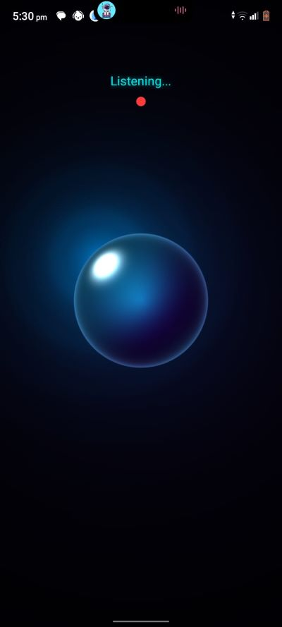

# Alan AI Assistant

Real-time AI voice assistant built with React Native, Expo, FastAPI, Groq, Gemini, Edge-TTS, and live websocket audio streaming.

  |   

---

## Features

- Real-time voice conversations
- Live streaming AI speech
- Interruptible speech generation
- Hybrid AI reasoning system
- Web search grounding using Gemini
- Persistent memory system
- Speech-to-text transcription
- Text-to-speech streaming
- Animated AI orb interface using Skia shaders
- Low-latency websocket communication
- Mobile-first AI assistant architecture

---

## Tech Stack

### Frontend
- React Native
- Expo
- TypeScript
- React Native Skia
- React Native Reanimated
- WebSockets
- Expo Audio

### Backend
- FastAPI
- Groq API
- Gemini API
- Edge-TTS
- SQLite
- FFmpeg

### AI / Voice
- Whisper Large V3
- Llama 3.3 70B
- Gemini 2.5 Flash
- Edge Neural Voices

---

## Architecture

User Voice → Speech-to-Text → Memory Retrieval → Groq Reasoning → Gemini Search Grounding → AI Response → Edge-TTS Streaming → Real-Time Audio Playback

---

## Core Systems

### Real-Time Audio Streaming
Alan streams audio responses in real time through websockets using PCM audio chunks for low latency playback.

### Interrupt System
Users can interrupt Alan while speaking, instantly stopping TTS generation and playback.

### Persistent Memory
Conversation history and long-term memory are stored using SQLite for contextual responses.

### Hybrid AI Pipeline
- Groq handles conversational reasoning
- Gemini handles live web search grounding
- Edge-TTS handles voice synthesis

---

## Frontend Highlights

- Custom animated AI orb built with Skia shaders
- Dynamic visual states:
  - Listening
  - Thinking
  - Searching
  - Speaking
- Real-time UI state synchronization
- Streaming audio playback system

---

## Run Locally

## Frontend

Install dependencies:

```bash
npm install

```bash
npx expo start
```

---

## Backend

Backend repository:

https://github.com/NayefNagib/Alan-AiAssistant-Backend

Clone backend:

```bash
git clone https://github.com/NayefNagib/Alan-AiAssistant-Backend.git
```

Install backend dependencies:

```bash
pip install -r requirements.txt
```

Run FastAPI server:

```bash
uvicorn app:app --host 0.0.0.0 --port 8000 --reload
```

---

## Environment Variables

Create a `.env` file inside the backend project:

```env
GROQ_API_KEY=your_key
GEMINI_API_KEY=your_key
HF_TOKEN=your_key
```

---

## Notes

- FFmpeg is required for audio processing.
- Backend uses websocket streaming for low-latency voice responses.
- SQLite is used for persistent conversation memory.

---

## Disclaimer

This project is for educational and research purposes only.

---

## Author

Ahmed Mohamed Nagib El-Sadany
